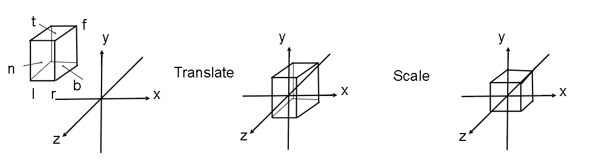

# GAMES101-现代计算机图形学入门
## 1. Transformation
Assume $v$ is a 3 dimension vector,  $k$ is a unit vector of rotation axis.  

Then, $v$ revolves around $k$ with $\theta^{\circ}$
$$v_{rot} = cos\theta v + (1-cos\theta) (v\cdot k)k + sin\theta v \times k$$

## 2. View and Camera Transformation
### 2.1 How to take a photo ?    
:bulb: **Model - View - Projection**     
### 2.2 How to perform view transformation ?
1. Define the camera, $\vec{e}$ is position, $\vec{g}$ is gaz direction, $\vec{t}$ is up direction.
2. locate the coordinate of objects under $\vec{e},\vec{g},\vec{t}$
3. transfer $\vec{e},\vec{g},\vec{t}$ to $\vec{x},\vec{y},\vec{z}$ with $\vec{g} = \vec{-z}$, $\vec{t} = \vec{y}$ and $\vec{x} = \vec{g}\times \vec{t}$
### 2.3 Rotation Matrix
For every affine transformation:
$$\vec{y} = A\vec{x}+\vec{b}$$
which is equal to:
$$\begin{pmatrix}
\vec{y}\\
1    
\end{pmatrix} = \begin{pmatrix}
    A & \vec{b}\\
    \vec{0} & 1
\end{pmatrix}\begin{pmatrix}
    \vec{x}\\
    1
\end{pmatrix}
$$
We know that transfor $\vec{x}\vec{y}\vec{z}$ to $\vec{e}\vec{g}\vec{t}$ with 
$$\begin{pmatrix}
R & \vec{b}\\
\vec{0} & 1
\end{pmatrix}
$$
and
$$R^{-1} = \begin{bmatrix}
x_{\hat{g} \times \hat{t}} & x_{\hat{t}} & x_{-\hat{g}}\\
y_{\hat{g} \times \hat{t}} & y_{\hat{t}} & y_{-\hat{g}}\\
z_{\hat{g} \times \hat{t}} & z_{\hat{t}} & z_{-\hat{g}}\\    
\end{bmatrix}
$$ 
and we know that $R = (R^{-1})^{T}$
## 3. Projection Transformation
### 3.1 Orthographic Projection
1. move the centre of cube to the original coordinate
2. scale the cube to $2\times 2\times 2$

### 3.2 Perspective Projection
All we should do is:

We can divide this process into two parts:  
1. Orthographic Projection $p\rightarrow p'$
2. scaling  $p'\rightarrow p''$

For step1:

we know that $y' = \frac{ny}{z}$ and $x' = \frac{nx}{z}$

For step2:  
Assume the hight of projection is $H$, and the hight of cube in the end is 2. Hence,
$$\frac{y'}{y''} = \frac{H}{2}$$

and the transfer matrix is 
$$\begin{bmatrix}
\frac{cot\theta}{Aspect} & 0 & 0 & 0\\
0 & cot\theta & 0 & 0\\
0 & 0 & \frac{f}{f-n} & 1\\
0 & 0 & \frac{fn}{n-f} & 0   
\end{bmatrix}
$$
with $Aspect = \frac{x}{y}$, $cot\theta = \frac{n}{0.5H}$